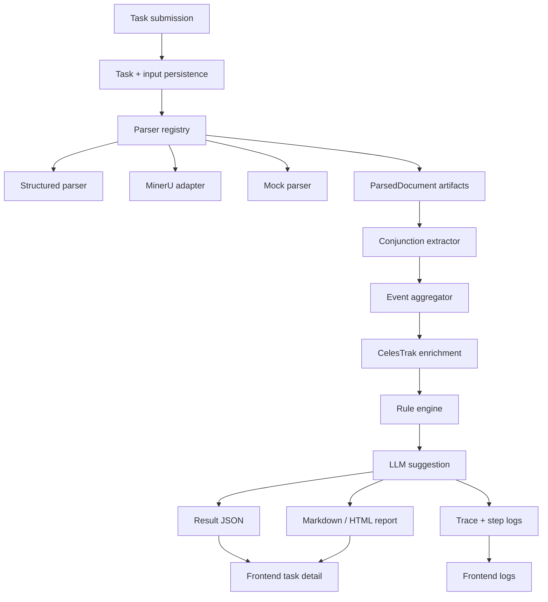

# Architecture

## Overview

Collision Agent uses a layered monolith:

- API layer: FastAPI routes for tasks, reports, trace, LLM logs, health, and evaluation
- Orchestration layer: in-process background task runner with persisted step logs
- Parsing layer: structured parser, MinerU adapter placeholder, and mock fallback
- Extraction and rule layer: field extraction, event aggregation, constraints, risk grading
- External context layer: CelesTrak client with mock fallback
- LLM layer: OpenAI-compatible client with mock/template fallback
- Reporting and trace layer: result JSON, Markdown/HTML report, and trace artifact generation
- Frontend layer: React dashboard for task creation and result inspection

## Core Flow

1. Create task via file upload, URL, or inline payload.
2. Persist task and inputs.
3. Run the orchestrator in-process and update task status.
4. Parse every input into `ParsedDocument`.
5. Extract conjunction events and constraint payloads.
6. Aggregate multiversion events into a latest-view thread.
7. Enrich events with CelesTrak context.
8. Evaluate rules and determine risk/manual-review status.
9. Generate LLM suggestions if enabled.
10. Persist result JSON, report, step logs, trace, and LLM call records.

## Mermaid Flow

## LLM Boundaries

The LLM is only used for textual recommendation and explanation generation. Canonical field extraction, aggregation, risk grading, and conflict detection remain deterministic and programmatic.

## Storage

- Database: task metadata, status, events, step logs, LLM call logs, report pointers
- File system: uploads, parsed document artifacts, result JSON, reports, trace, mock assets

